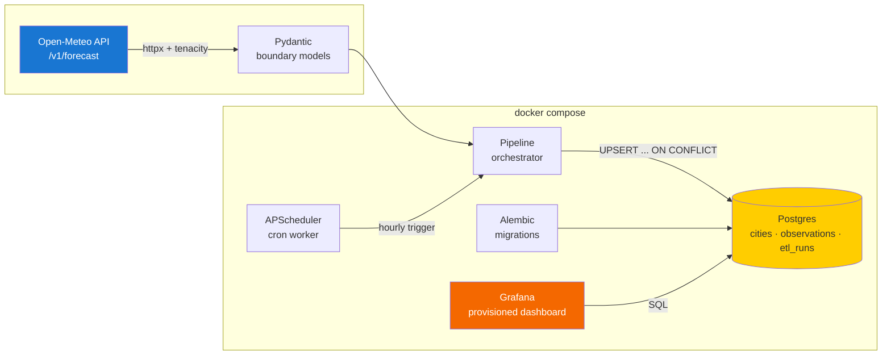
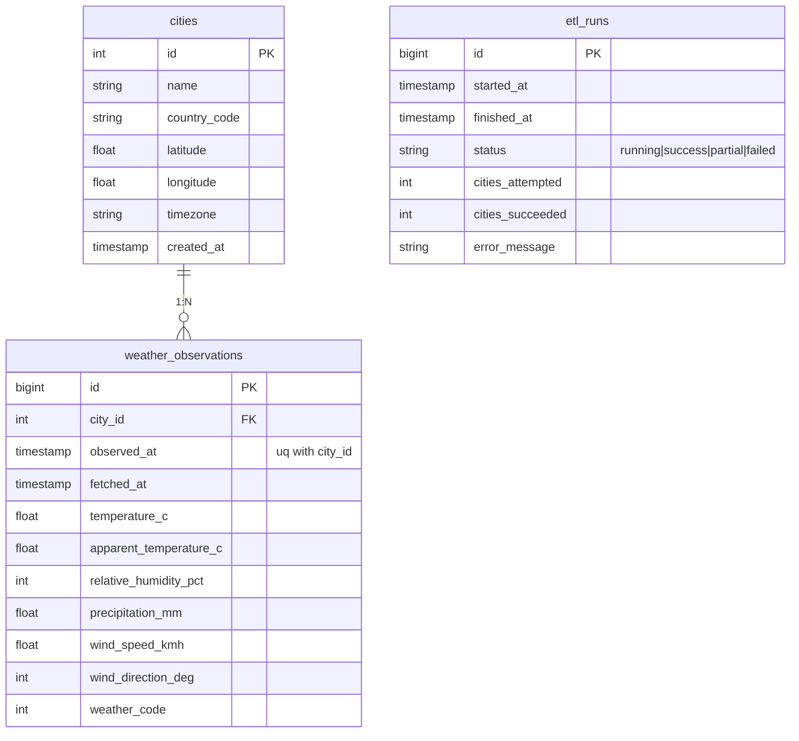

# Weather API Pipeline

> Scheduled multi-city weather ingestion (Open-Meteo → PostgreSQL) with Alembic migrations and Grafana dashboards. One `docker compose up` away from a live data pipeline.

[](https://github.com/wxssxm/weather-api-pipeline/actions/workflows/ci.yml)
[](https://www.python.org/)
[](LICENSE)
[](docker-compose.yml)
[](#testing)

A small but complete data pipeline: hourly cron job pulls weather for 10 cities from Open-Meteo, validates the payloads through Pydantic, persists into a Postgres schema managed by Alembic, and exposes the result through a provisioned Grafana dashboard. Built so a recruiter can clone, `docker compose up`, and see live data in three minutes.

## Architecture



The orchestrator runs three phases per scheduled tick: **start an `etl_runs` audit row → fetch each city under per-city try/except → close the run as `success | partial | failed`**. Failures on a single city never abort the run; the audit row records exactly what happened.

## Stack

| Layer | Technology |
| --- | --- |
| API | [Open-Meteo](https://open-meteo.com/) (free, key-less) |
| HTTP | [httpx](https://www.python-httpx.org) async + [tenacity](https://tenacity.readthedocs.io) retry on 5xx/timeout |
| Validation | [Pydantic 2](https://docs.pydantic.dev) at the boundary |
| Database | PostgreSQL 16 |
| ORM / migrations | [SQLAlchemy 2](https://www.sqlalchemy.org) + [Alembic](https://alembic.sqlalchemy.org) |
| Scheduler | [APScheduler](https://apscheduler.readthedocs.io) (BlockingScheduler, cron) |
| Dashboards | [Grafana 11](https://grafana.com/) — datasource + dashboard provisioned from files |
| CLI | [Typer](https://typer.tiangolo.com) + [Rich](https://rich.readthedocs.io) |
| Config | [pydantic-settings](https://docs.pydantic.dev/latest/concepts/pydantic_settings/) |
| Tests | pytest + [respx](https://lundberg.github.io/respx/) + [pytest-asyncio](https://pytest-asyncio.readthedocs.io) |
| Lint / format | ruff + black + pre-commit + detect-secrets |
| CI / packaging | GitHub Actions (Postgres service), Docker multi-stage, [uv](https://docs.astral.sh/uv/) |

## Quickstart

```bash
git clone https://github.com/wxssxm/weather-api-pipeline.git
cd weather-api-pipeline
cp .env.example .env

# Bring up Postgres + run Alembic + start the scheduler + start Grafana
make docker-up

# Wait for the scheduler to log "Run … status=success", then open:
open http://localhost:3000  # admin / admin (anonymous viewer enabled)

# Tail logs
make logs

# Tear down
make docker-down
```

The `migrate` service runs Alembic to head before the scheduler starts; the scheduler itself triggers an immediate ingestion on startup (`INGEST_ON_STARTUP=true`) and then runs every hour at `:05`.

### Local development without Docker

```bash
# Spin up just Postgres
docker run --rm -d --name pg -p 5432:5432 \
  -e POSTGRES_USER=weather -e POSTGRES_PASSWORD=weather_dev_only -e POSTGRES_DB=weather \
  postgres:16-alpine

make install
make migrate
make seed
make ingest        # one-shot run
make test-unit     # unit tests, no Postgres needed
make test          # full suite incl. Postgres integration tests
```

## CLI

```bash
weather --help                    # discover commands
weather migrate                   # apply Alembic migrations
weather seed-cities               # insert the 10 default cities (idempotent)
weather list-cities               # rich table of seeded cities
weather ingest-once               # single ingestion pass, prints report
weather run-scheduler             # blocking long-lived process (used by docker)
```

## Schema



The `(city_id, observed_at)` unique constraint on `weather_observations` makes ingestion idempotent: a re-run for the same observation timestamp is a Postgres no-op via `ON CONFLICT DO NOTHING`. The `etl_runs` table captures every attempt — useful for debugging and for showing pipeline reliability over time on a dashboard.

## Cities

10 cities hand-picked for geographic and climate diversity:

| City | Country | Latitude | Longitude | Timezone |
| --- | --- | ---: | ---: | --- |
| Paris | FR | 48.86 | 2.35 | Europe/Paris |
| London | GB | 51.51 | -0.13 | Europe/London |
| New York | US | 40.71 | -74.01 | America/New_York |
| Tokyo | JP | 35.68 | 139.65 | Asia/Tokyo |
| Sao Paulo | BR | -23.55 | -46.63 | America/Sao_Paulo |
| Cape Town | ZA | -33.92 | 18.42 | Africa/Johannesburg |
| Sydney | AU | -33.87 | 151.21 | Australia/Sydney |
| Mumbai | IN | 19.08 | 72.88 | Asia/Kolkata |
| Singapore | SG | 1.35 | 103.82 | Asia/Singapore |
| Dubai | AE | 25.20 | 55.27 | Asia/Dubai |

## Grafana dashboard

A single provisioned dashboard ("Weather Pipeline") with three panels:

1. **Temperature by city** — 7-day timeseries
2. **Humidity** — 24-hour timeseries
3. **Peak wind by city** — 24-hour bar gauge

Datasource and dashboard JSON live in `grafana/provisioning/` and `grafana/dashboards/` respectively; both are mounted read-only into the container so any change in the repo propagates on the next compose up.

## Testing

```bash
make test-unit     # 26 unit tests, no DB needed
make test          # adds 8 integration tests against real Postgres
make lint          # ruff + black checks
make format        # auto-fix
```

| Suite | Count | Purpose |
| --- | --: | --- |
| Unit | 26 | Config, cities, Pydantic validation, respx-mocked HTTP, pipeline orchestration with mocked DB+API |
| Integration | 8 | Real Postgres: repository CRUD, run state machine, end-to-end pipeline with mocked HTTP |

Local unit-only coverage sits at **79%**. CI runs the full suite with a Postgres service, which exercises `repository.py` and `session.py` end-to-end and pushes coverage above 90%. The `--cov-fail-under=70` gate is enforced in CI.

## Reliability touches

- **Idempotent ingestion** at two levels — `upsert_cities` and `insert_observation` both use Postgres `ON CONFLICT DO NOTHING`, so re-runs never break.
- **Per-city resilience** — one bad request doesn't abort siblings.
- **5xx-only retries** — `TransientUpstreamError` is the only thing tenacity retries on. 4xx (bad lat/lon, etc.) escapes immediately so we don't burn the rate limit on permanent errors.
- **Audit trail** — every run lands in `etl_runs` with attempted/succeeded counters and a status, so a dashboard panel "succeeded vs attempted over the last 7 days" is one query away.
- **Schema versioning** — schema changes go through Alembic migrations applied by a dedicated `migrate` compose service that the scheduler depends on.
- **Concurrency-safe scheduler** — `coalesce=True, max_instances=1` so a slow run can't overlap itself.

## Roadmap

- [ ] Hypertable / TimescaleDB extension for `weather_observations` (chunk by day)
- [ ] Forecast endpoint (currently only `current`) for predicted vs actual comparisons
- [ ] Slack/Discord webhook on consecutive `failed` runs
- [ ] Backfill CLI command using Open-Meteo's archive endpoint
- [ ] Hot reload of the cities list (currently static seed)

## License

MIT — see [LICENSE](LICENSE).

## Author

**Wassim Fayala** — Data Engineer apprenti @ La Forge (Paris)

[LinkedIn](https://www.linkedin.com/in/wassim-fayala/) · wassimfayala2@gmail.com
